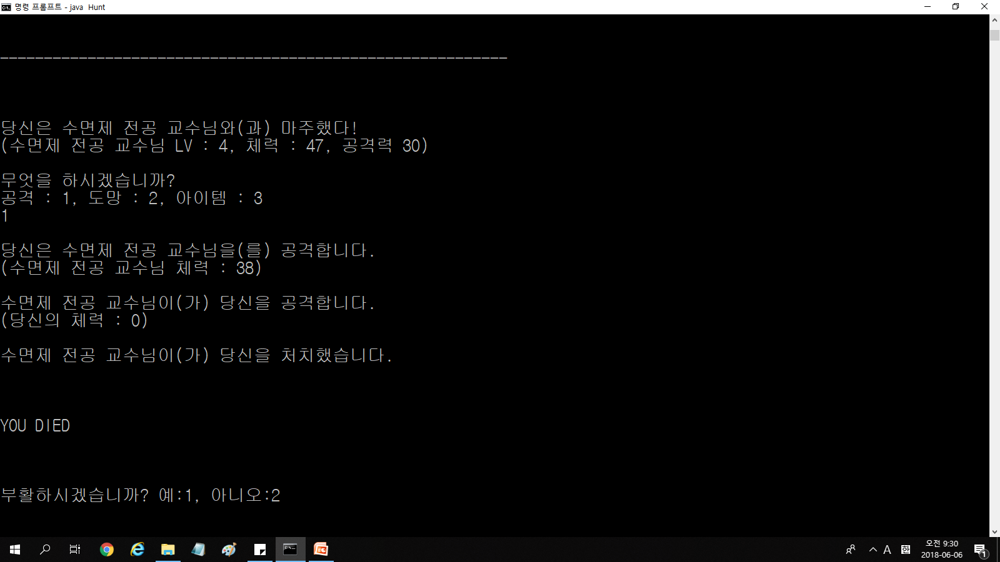
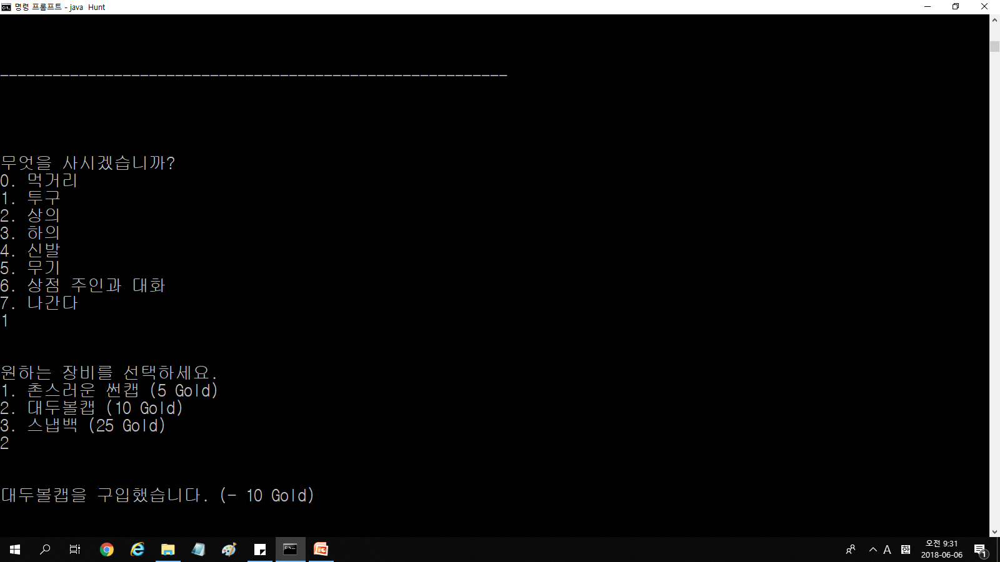
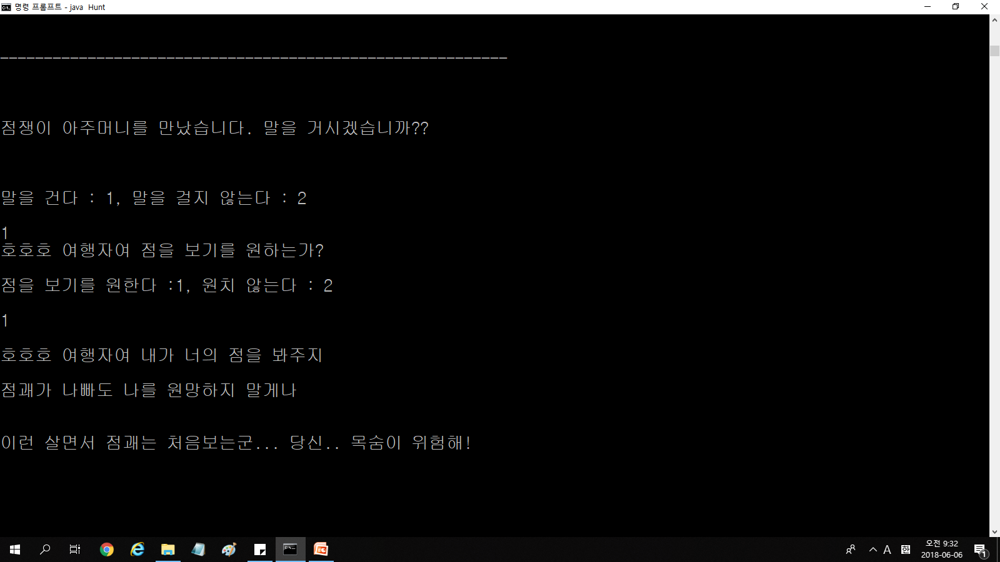
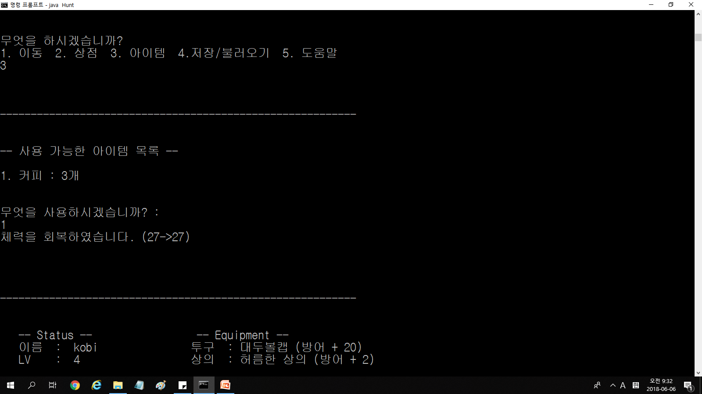
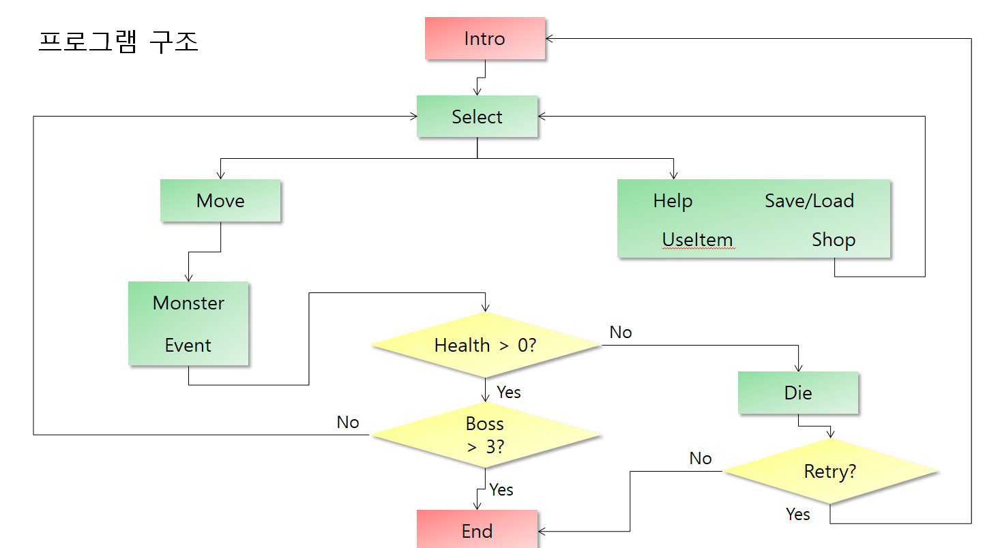
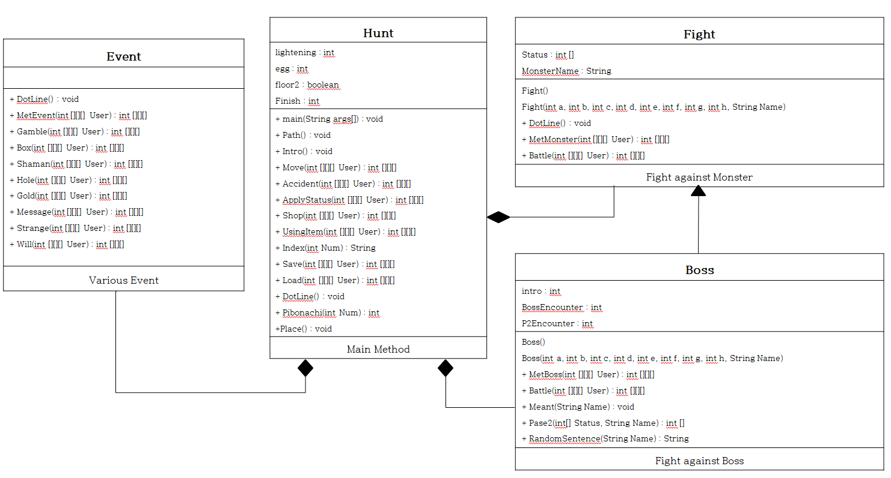

# Text-RPG

## 0. 개요
텍스트 RPG 게임이다. 

검은 화면에 하얀 글자로 데이터를 표현한다. 플레이어는 8개의 상태를 가지며, 게임을 진행하면서 몬스터를 사냥한다. 사냥을 하면 골드와 경험치를 얻고, 경험치를 모아 레벨업을 하여 능력치를 상승시킬 수 있다. 골드로 상점에서 아이템을 살 수 있으며, 보스 몬스터를 3마리 잡을 경우 게임이 종료된다. 몬스터에게 사망할 경우 부활할 수 있으나, 처음부터 다시 시작해야 한다.
## 1. 실행화면
;

## 2. 플로우차트

## 3. 구성

